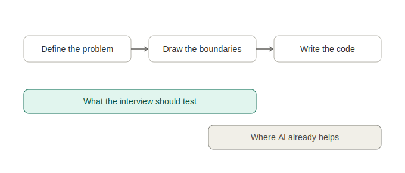

AI in interviews is inevitable. So the question is what should we test for?

Over the last couple of years of interviewing, with the rapid evolution of LLMs, a series of questions continues to arise on all sides of the interview experience: Should we allow AI in the interviews? Should we detect it? Should we re-design the whole process around it?

I think the change is inevitable at this point, so my question is: once we allow AI and agents to be freely used in interviews *what do we test for?*

In interviews I run, and in the ones I help others prep for, I give open-ended problems with intentionally vague requirements. They have to figure out what to solve for before they solve it.

The goal is observing how they think — what they focus on first, how they navigate the ambiguity, and how they handle the size of the problem.

What I've noticed across seniority levels is that the thing that separates strong candidates from the rest has very little to do with code. I am asking myself, can they take something messy and ambiguous and break it into clean pieces and decide what matters? Do they know which parts to go deep on and which to ignore for the level they are solving? Engineers with strong decomposition instincts move the interview forward through questions that allow them to disambiguate the complexity and move towards understanding the problem and ultimately building a solution.

That's abstraction: choosing what a component should know, what it should expose, and what it should ignore. Every well-designed API, every service boundary, every module that aged well in a codebase started with someone deciding what to leave out.

AI can extract & apply known patterns, refactor, generate clean interfaces and even navigate easily through messy designs and APIs. But the judgment of *where* to draw the boundary, what belongs together, what should be hidden, what level of detail is right for this conversation, that comes from understanding the problem deeply enough to decide what to leave out.

When a candidate skips that step, you can see it immediately. They stumble at the problem definition itself, before there's anything to code, before AI could even help. The ambiguity alone is enough to expose the gap. *The depth of the thinking shapes the surface of the result.*

I've spent over 15 years building software across different countries and companies, and this has been a consistent observation: the engineers who struggle aren't struggling with tools or syntax. They're struggling with the step before the tools: abstraction, encapsulation, separation of concerns. The timeless software concepts that are hard to learn, hard to teach, and harder to apply. Conversely, really good engineers know their tools well. I don't think LLMs remove this, if anything it adds new terms to describe it: loops, prompts, specs, agent instructions, evals, intent.

Let candidates use AI. The challenge is calling for a new interview process altogether, to give them a problem where the hard part is not writing the code.

What are you seeing in your interviews? What skills are surfacing or mutating?
