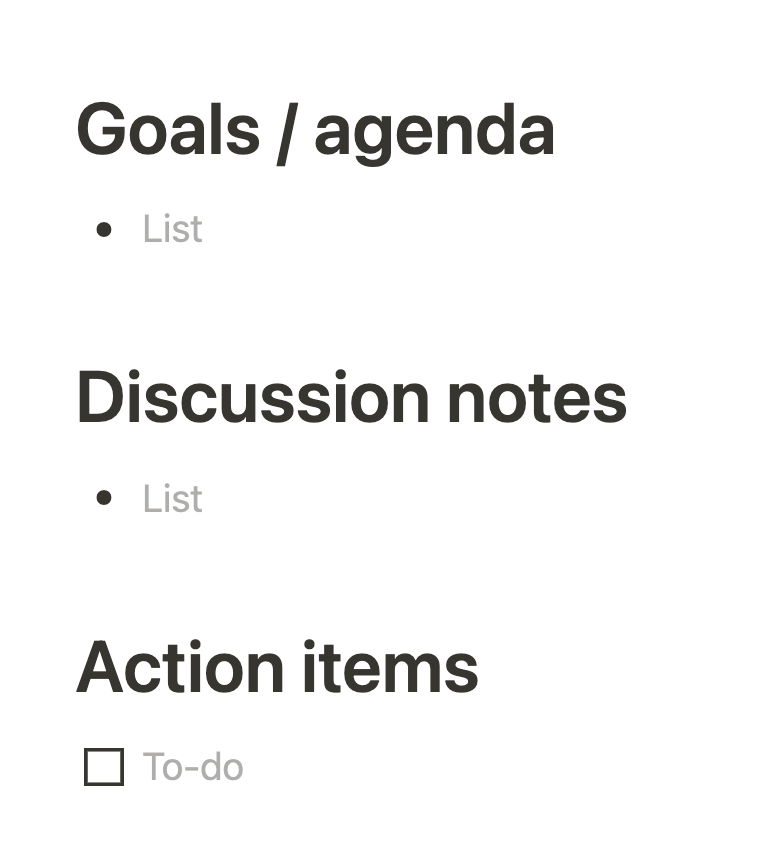

> *Okay. All right, now, let’s see. Where were we? Oh, yes. In the Pit of Despair.” — returning to my home desk Monday morning after not thinking about work since Friday evening —* [iamdevloper](https://twitter.com/iamdevloper/status/1424347418162827266?s=21)

It all started with trying to avoid the Pit of Despair. It happens on Mondays, but also after long meetings, switching between fairly different contexts and long debugging sessions.

I’ve come to realize that you are determined by the time it takes you to bounce back after interruptions. Ideally, we are able to get blocks of time uninterrupted but let’s face it that’s becoming increasingly rare. Meanwhile, I have created a system to make sure I can continue faster after an interruption. Make no mistake, I still struggle to focus on deep work after many switch backs. These strategies have helped me bounce faster. Given the choice to bounce or be bounced, I choose the former. You are bounced when you are moving from meeting to meeting and interruption and context switch between projects and you feel like those big balls where you seat slightly bouncing not sure where you were going.

Bounce by yourself means that as you switch tasks and focus you have a place to re-anchor you into the project or task that needs your attention now. This is not technical at all, but I’ve found that it affects my technical output.

#### So how do you bounce, you ask? Here’s the system.

First of all, have visible the things that you’re working on that are more long-term. Long-spanning projects, services, designs etc. Those usually are the ones that would be interrupted by more immediate requests and meetings. I keep a <ProjectName> notes file and a folder for each of these. At the end of each one, will add a note of what I was doing or trying to accomplish before I switch tasks. Sometimes you don’t have a lot of time so choosing a couple of words that will bring you back to where you were is an art more than a science: pick the two or three words that most basically describe what you were doing: kafka schema for plant\_disease data. Note that this is very personal and very project-specific. This is not a post about tools, but whatever tools or note software you use, better have good search capabilities. The added benefit is that you are creating a trail of what you have done, which you can use to outline blog posts, in discussions with your manager, or for when the performance evaluation period comes and you forget that you did anything. In ink I trust: ink in paper, ink in screen, we forget so much.

For shorter-term tasks and projects, depending on the level of abstraction you have to engage in and the urgency, I might create a file for it or not. Some things are so prescient and well-defined that I do not need reminders. The models I have to keep in my head can only live there in their entirety as long as I’m focused enough and that is a fleeting feeling. We look for consistency, not puffy fleeting moments of our minds holding models.

#### For commands:

I know engineers that know all the commands by heart, all of them. I realized my shortcomings early on: I know commands up until I have to code in front of someone or urgent issues come in and I suddenly forget. I don’t think this is the case for everyone, but it has been definitely mine. Knowing and keeping commands that I use daily in my head is normal, but the problem is when recall fails, what stays? Ink in paper. So I have a text file for usual commands that I have to use on a daily basis: git commands, build system commands (gradle, maven, npm), project-specific commands, and common unix commands. Most of the time I do not have to look at these files, yet I keep them because when I do, it avoids frustration when my mind is too cluttered to recall them. These are also a google search away, but you see, my commands notes are fairly curated already, I do not have to parse StackOverflow answers and test things working. These are commands I use fairly regularly and have tested many times. Also in unix-like systems, Command+R is your friend. That friend that you are so connected with that it finishes your sentences. I love Unix, I think we are just trying to catch up in the web to the unix command line. And in it appreciation for its beauty I keep them commands close.

All these processes are tiny love letters to my future, hurried, stressed self. In those moments, I subscribe to the thinking that is [better not to be stupid](https://fs.blog/2019/01/how-not-to-be-stupid/) than to be clever. There are circumstances that make us operate at a lower cognitive frequency. These notes are for those moments.

#### You get a meeting, and you get a meeting and you get a meeting

For meeting and project notes, code snippets, and drafts of blog articles I use Notion. I have a Wiki for project notes and blog articles, plus technical subjects I learn or want to learn more I will put notes on one page within the wiki. I will add there mind maps, interview session notes, memos drafts and summaries of high-level concepts I might need in writing for recollection or sharing with others.

In Notion, I also keep an almost complete record of meeting notes of all the meetings I attend. Unless I am writing notes in another common doc for the meeting I always write notes of meetings I participate in this Notion space. I use the default Notion template for meetings and like the Ad Hoc format very much for non-recurrent meetings.

Then I’ll go through the action items checking them before the next meetings.

#### In the end, does it even matter? Linkin Park, probably

Now you might have gotten to this point and found these are trivial. Or that engineers know these things by heart and can regurgitate them in an interview. I think that we each have to find the best ways in which we work, not based on our best days, but on our stressful low days and moments. Because on those moments, we still have to show up and our minds tend to fly off. Part of creating space for that process is having a system that allows me to come back faster and with confidence. It also allows for a form of documenting your work over the years, synthesizing learnings and introspecting on growth opportunities for your skills.

So how do you bounce? I would love to hear others’ strategies!

---

*Originally published on [Medium](https://medium.com/@mlescaille/bounce-strategies-for-coming-back-to-code-after-interruptions-4e1e9a1b3ceb).*
