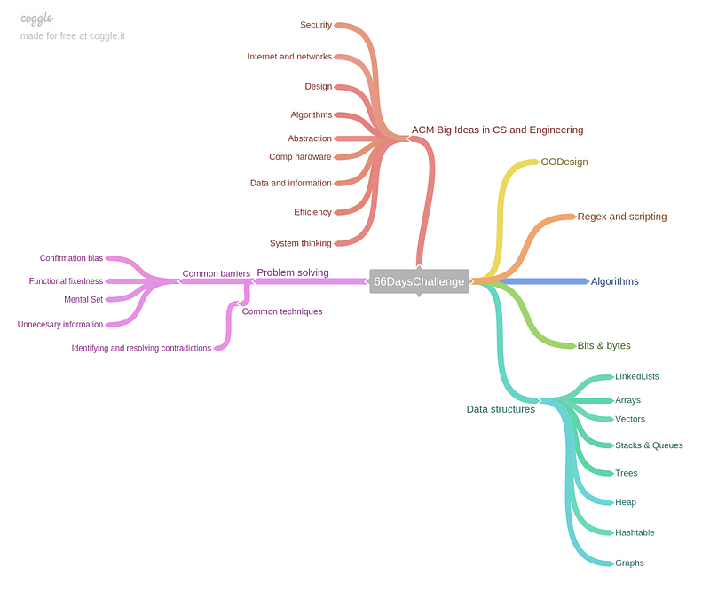

Mind maps.

I said in [Day 5](https://medium.com/@mlescaille/day-5-538cd549eac1#.puscnpb8m) that I will be starting a mind map to track, organize and help with measuring my progress in the 66 days challenge. I have read [Pragmatic Thinking and Learning](https://pragprog.com/press_releases/pragmatic-thinking-and-learning-refactor-your-wetware) and other sources where mind maps are recommended in the learning process and they emphasize the importance of putting pen to paper for creating your mind maps. However, I had this feeling that this mind map wouldn’t fit in the letter format paper that I have, so I started looking for software. Most desktop software just didn’t fit what I wanted. I didn’t want much, just what I do on paper, with colors pointing to wherever I want on my screen. I found an app recommended on Lifehacker that is pretty good [SimpleMindFree](https://play.google.com/store/apps/details?id=com.modelmakertools.simplemindfree&hl=es_419), but still, phone is even smaller compared to paper. I wanted something on my computer. And today I came across a recommended site and decided to test just one more. It’s a web application Coggle, so even better for me as I don’t have to wait to get home to add new things to my map. It has 3 pricing options and one of them is free forever with one private diagram and the rest public. I am testing it so far and haven’t found a reason to upgrade as the basics pretty much covers what I wanted.

I started organizing with the information I have covered somehow until now. It certainly will be restructured many times I foresee. And you can already see how are things overlapping here. That’s a good thing.

This will help me keep track of the concepts I have visited and practice. I would to add a way to put if I have cover the theory or have practiced the subject, or both. Coggle let you link an image, link or icon to the items in the map, maybe I can come up with a system with the icons to mark it as practiced or only read about it.

Happy coding practice and Merry Christmas!

P.S

*This article is part of a 66 days challenge of coding practicing, reading and learning outside work as a software engineer. Start at* [*Day 1*](https://medium.com/66-days/day-1-fb0f1fbce484#.o7bly7ey1) *for an explanation of my motivations.*
