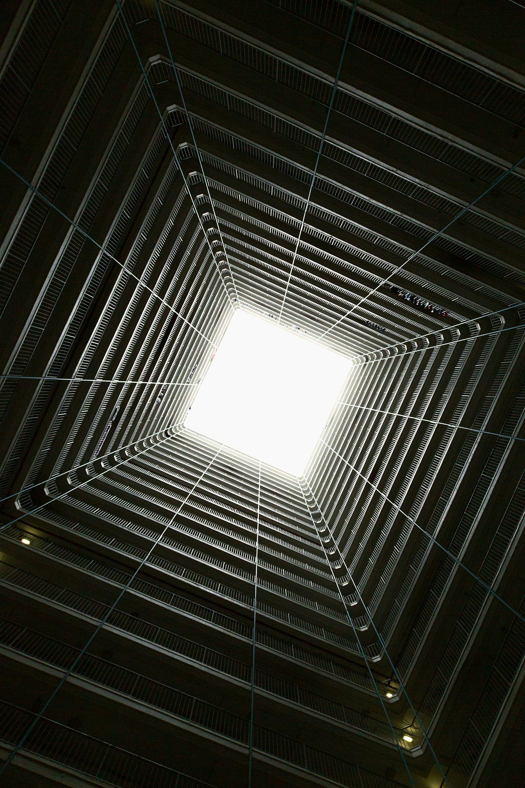

A career in tech is my dream life. You see, it’s not like I was dreaming about it since I was a kid. No, I didn’t grow up with computers, no one around me had one. But I fell in love with the possibilities that computers seemed to be able to create. I was 17 in high school. I was studying for the college exams in engineering. A teacher came to drag us to this presentation by a computer science college. I hid part of my uniform to say I couldn’t go: they didn’t allow students without full uniforms in the theater and in class. She insisted we went anyways. My friend and I went and sat as far back as we could. And then love happened. They showed a car simulation program students had programmed. They talked about that this was done with ***software***. I was fascinated. I told my friend I will go to this school. Changed all my previous decisions about engineering, and that other city the engineering college was to go to a faraway university across the country, everything. My friend was mad at me for quite some time.

### Loving what you do is a blessing. But over-identifying with it can lead to burnout

Loving what you do and study for is a tremendous blessing. But it can be a huge burden as well. Particularly if you identify with it if it becomes part of who you think you are to the world. It’s no secret the demanding that is engineering work. Don’t get me wrong, I’m not comparing working in tech with demanding physical work. It’s hard in the ways it changes constantly. It’s hard in that is work that you have to consciously choose to put away. You don’t leave the work when you stand away from the computer or leave the office. Put these things together: strong identity with the work, continuous learning, and constant demands for increased productivity and the result is hard work. If you don’t find the time, space, and attention for other areas of your life you might get burnout. What is burnout anyways? To me, is being in a dark tunnel you have been walking through for a long time with no sign for light, no signs of the end. It’s a reduction of perspective and possibilities of what you can be and do. It’s a sense of tiredness that does not end. You probably know the feeling. Sometimes we can see it come and act before it drags us down. Sometimes it hits like a truck losing the brakes on the highway.

#### How to prevent burnout?

The single most important thing I have to do constantly is self-reflection. What reflection allows is to remain self-aware but also never forget perspective. Never forget possibilities. I do this consistently now in the form of evening retrospection: bullet points I write at night of reflections I have in my mind. Here are other techniques to keep me sane on a regular basis:

*   Nature: daily walks. Walking helps process information, and widen our views
*   Take breaks, real ones
*   Talk to my friends
*   Plan for proper sleep time
*   Nutrition: make sure I’m eating enough and with the right nutrients for me
*   Hobbies: writing poetry, reading, watching movies anything that is outside work that fulfills you. Experiment if nothing comes to mind, explore with a childlike worldview.
*   Find a self-care practice: a set of steps you have for yourself that put you in a good state
*   Intentionally set time away from screens

### How to get burned out?

It’s also important to identify what makes you burn out. Ideally, before you are in the sink of despair. To me, these are the signs of alerts:

*   Being tired all the time, I know I’m not refilling my energy properly. Sometimes it has been an actual physical disease, like anemia or vitamin D deficiency so it plays to look at all sides
*   Lack of interest in things I’m usually interested in
*   Seeing only one side of life: is all like this, any sign of being absolutist in language

You might notice that these are signs of potentially many other things like depression, grief, or change in preferences or goals. And that’s fine because these are things I’d like to be aware of as well.

I have this view of life as walking on a horizontal beam held by a vertical one in the center, if we walk too much to one side or the other it flips on us. And so we need to find that center and seek balance. What is the center is a question that each of us has to answer for ourselves at each point of our lives. Burnout is walking too much on one side of the beam. Find what balance you out to prevent being burned out. Now, you might say this is simplistic, other people drag me out, my boss is this or the other, my spouse doesn’t help around the house, my family has all these demands. My business will fail if I don’t dedicate all the time to it. And that is the tradeoff life is asking of you. That still among the demands, the lack of time and resources and other people’s lack of consideration for your health and wellbeing **you** consider it and plan for it. That you set boundaries to prevent life sinking you in. That you learn to stand strong in protecting yourself when you are being pulled in many directions. That you exercise the power you have been given with the word **no**.

You don’t do any favor to anyone if you are burned out anyways.

---

*Originally published on [Medium](https://medium.com/@mlescaille/how-to-prevent-burnout-4e039a27870e).*
