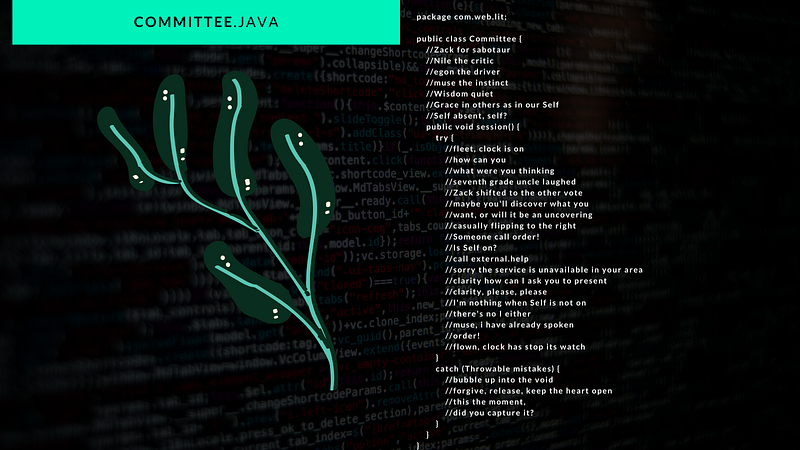
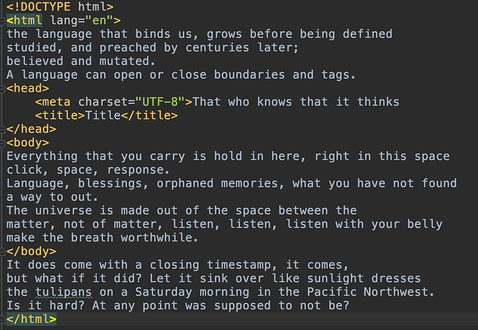

Writing code is part of the craft of creating software and I have dedicated enough time to it to see it similar to the flow of writing. There is a structure and rules and sure the compiler won’t be as lenient as some editors might prove to be, but the flow is there. And so at some point, weaving them together made sense. *There are only two things hard in computer science: cache invalidation and naming things (and off by one errors)*. And you’ll see how that shows not only in my actual classes at my day job, but in how I named this modality codems, a portmanteau of code and poems. In a codem, the code structure adds sense to the poem and the poem is built within the structure of the code, under the allowed syntactic definition, which means the code will be executable in a computer and also will provide visual character to the poem structure while still presenting itself as a poetic expression.

What I love about codems is how it allows merging two seemingly unrelated worlds into one expression. One canvas, many forms.

As I explored creating in merging with code, and the tools to create code to write poetry, I realized a bigger question to explore: what is the potential for the interplay of machine, human, and poetry to provide new language and ways to express poetically? That is to say, this is only the beginning of this bending of what seemed to be hard fences between art/poetry and code. As concerts and painters are taking over the world of Fortnite, what other art expressions will be transmuted by code, algorithms, and tools? That my friends it’s the question for the future; for me now, there is more code, more poetry and more weaving of the two.

---

*Originally published on [Medium](https://medium.com/@mlescaille/introducing-codems-code-and-poems-weaved-3122b1c919af).*
