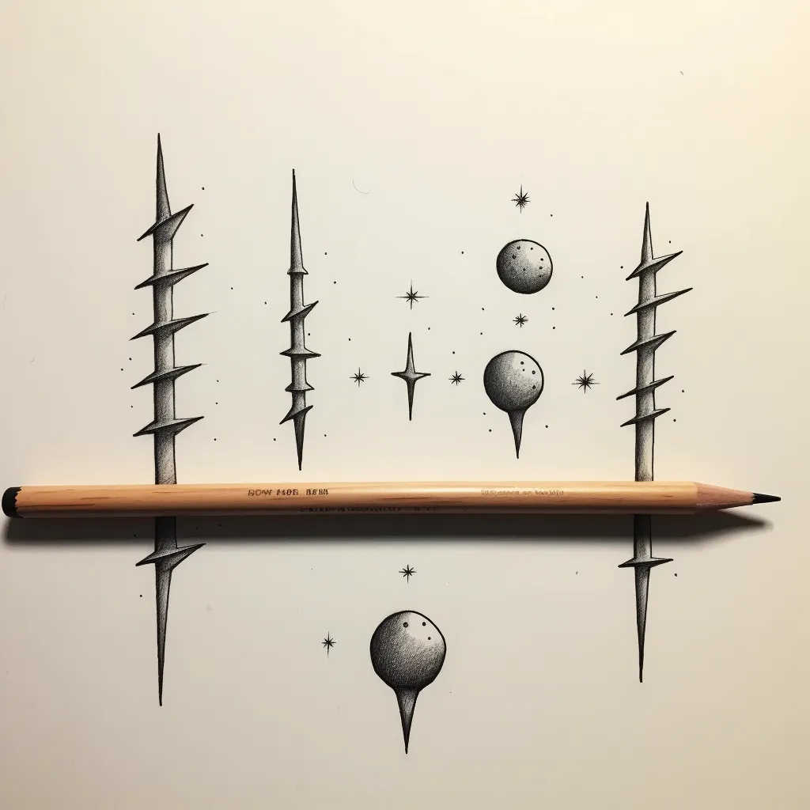

A couple of weeks ago I took a family member to a barbershop for the first time in the US. I sat to wait for him. When he finished, he said that he barely felt the barber cutting his hair. It was so delicate; it didn’t even feel like he was getting a haircut. ‘I am used to other barbers that put their arm on you, force your head sideways as they move the razor through your head, “ he said. ‘I just didn’t feel much this time, and it looks great.’ I replied that this is what expertise looks like; it is almost unnoticeable. It makes the action look easy. *The deeper the roots, the smoother the surface*. It is only apparent to the eyes trained to recognize it.

Reflecting on the subtlety and expertise of the barber’s craft, I was reminded of a different kind of expertise — discovering and understanding personal strengths. One that is necessary to recognize expertise itself. This parallel brings me to the [VIA Institute of Character’s](https://www.viacharacter.org/) test for strengths and weaknesses, I took their test a couple of years ago. According to the VIA institute, my top strength is ***Appreciation of beauty and excellence***, described as ‘noticing and appreciating beauty, excellence, and/or skilled performance in various domains of life.’ [The Noel Strengths Academy](https://sites.google.com/apu.edu/noel-strengths-academy/home) further defines it with characteristics such as living with a sense of awe and pursuing wonder in everyday experiences.

This exploration led me to see strengths as something existing on a metaphorical beam, positioned in the middle for optimal use and on one extreme overuse (weighting too much on the balance) and on another underuse (not weighting it enough). For appreciation of beauty and excellence, underuse can lead to oblivion, while overuse can manifest as perfection. Sounds familiar?

I continued delving into another identified strength: curiosity. Something intrigued me in what I found from researching more on its underuse and overuse scopes. Back in Cuba, we have a saying for those who are enmeshed a little too much in other people’s lives: chismoso (roughly translated from Spanish as busybody, nosy). [A study](https://oxford-review.com/the-5dc-dimensions-of-curiosity-and-the-curious-people/) on the factors involved in curiosity defined 5 dimensions of curiosity. [One of those dimensions](https://oxford-review.com/the-5dc-dimensions-of-curiosity-and-the-curious-people/) is *social curiosit*y: wanting to know what other people are thinking and doing by observing, talking, or listening in to conversations. Turns out that a lot of “chismosos” are simply indexed too much in the social dimension of the trait and under indexed in other dimensions like joyous exploration and stress tolerance. It reminds me of a similar behavioral issue: *a lot of worry comes from a misuse of creative talents.*

In observing the artistry of a skilled barber and delving into the exploration of personal strengths, we embark on a journey of self-awareness, self-fulfillment, and collective awareness (if applied to team/community dynamics). Personally, my career transformed for the better when I acknowledged my unique strengths, guiding my choices in career paths, jobs, teams, and projects. In 2016, as I chose a company to join in the US, traits like curiosity, autonomy, and high adaptation were crucial in recognizing the need to align myself with an environment that provided ample space for growth based on those traits.

Consider the strengths that guide you, and as you navigate your path, invite others to do the same. What strengths shape your journey, and how do you leverage them for success? In what ways do you leverage your strengths to contribute to a balanced and effective team dynamic?

---

*Originally published on [Medium](https://mlescaille.medium.com/like-a-haircut-you-can-sleep-through-3ddc8d8f0b95).*
