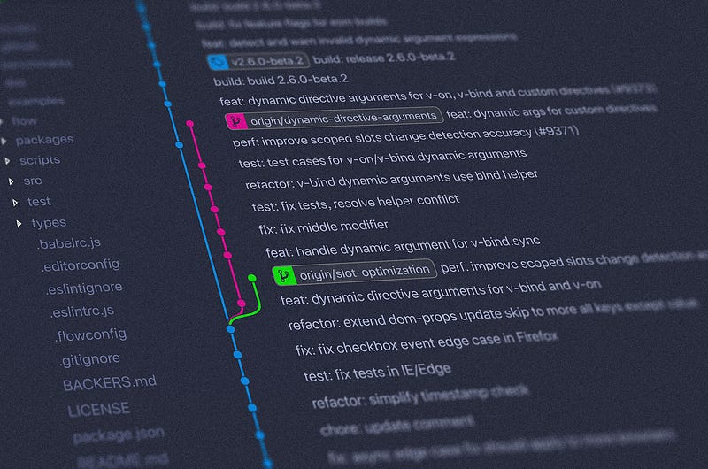
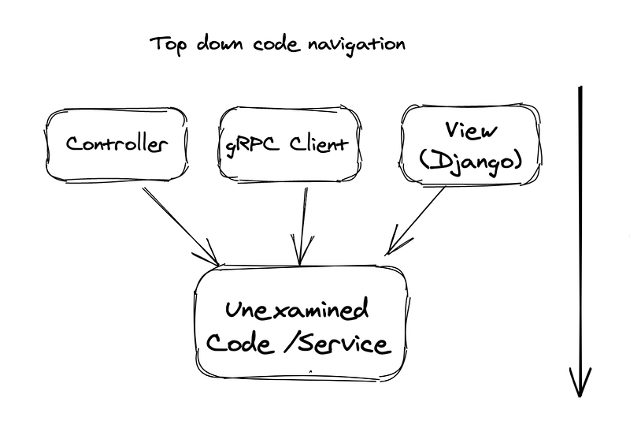
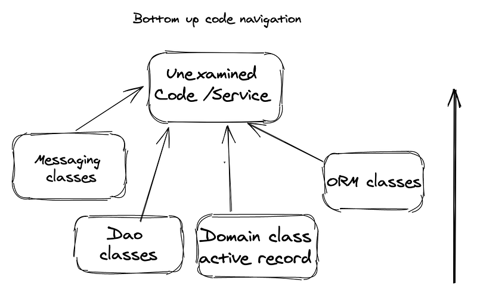

I joined Netflix at the end of September last year, yes that is the now unforgettable year of our lives, 2020. This year 2021, I turn 10 years of working as a software engineer and I thought to combine these two relevant events to write about the merits and perils of navigating existing systems when joining a team. It’s a subject that it’s not sufficiently explored and one that we all we’ll have to face in our careers considering [that](https://www.youtube.com/watch?v=3gib0hKYjB0&list=PLf9p-N3ltMTvlrgdb4uMP7r1XJCYtiY8a&index=1) *as soon as software comes into being the needs that addresses changes* and *70% of development budget goes into software maintenance*. So how do you effectively navigate a new codebase? These are the strategies that I use and the questions I ask myself in the process.

First, let’s set some context. Depending on the role one joins, the team and the business the company is in, the task of navigating an existing codebase will vary widely. When I joined Upwave (formerly Survata), the startup I worked at until last year, my very first task was to fix a long standing bug in a Grails backend codebase. Since that story is not part of this post, I’ll use it to compare it to my task joining the Device Identity Systems team at Netflix (we are hiring!! ) which was taking over existing services and rebuilding them in a new system. You can see those two tasks have very different goals in focus and outcome. This is the place for the proverbial YMMV, Your mileage might vary, adjust accordingly.

### Identifying your goals to not get lost (too much)

While looking at new code, you might find a curiosity inducing piece of code (wow what is this doing here, or what are they doing with this?) and you might feel tempted to go down the rabbit hole to see it do and even play with it, this is both natural and the very first urge to resist. Keep your eyes on the prize, go back to your initial goal. Or maybe you are having trouble finding the code related to the task at hand and you start getting frustrated or discouraged, which in my experience is totally normal, remain looking. Search tools are incredibly helpful in this stage. For the actual search terms, having a basic understanding of what the system does or intends to do is helpful while searching because it can give you a reference point of how modules, packages, classes and functions can be named. I tend to try to ask questions about the domain that the system is built in to start getting a sense of this part. Knowing what to look for is the very first step. Staying on task, the close second.

### Trusting your knowledge

I always assume that for new things I might not understand all there is to understand the first time or the second, but I trust that eventually I’ll make the connections if I remain curious and on the task. In this respect, going around a new codebase is similar to reading technical books. Or according to the Nobel prize-winning physicist Richard Feynman, [similar to how to learn anything](https://fs.blog/2012/04/feynman-technique/). Cycles of read, explain, identify gaps, review and simplify. Our brains tend to make sense of the things we have seen while we are engaged in other things, so make sure to give it time to digest all the new information you are feeding it in a short period of time.

### Process

There are two ways to look at the actual process of navigating existing systems, the technical one and the process of handling yourself and your emotions. Yes, there will be emotions, there are always emotions. My experience is largely with enterprise systems in the Java ecosystem, which has particular code layout and structure, but in general I have used this process for any code I review.

### Technical process

Start by locating the module, file(s), class, function and finally line(s) of code relevant to the immediate task or goal at hand. This might be done by search or plain old clicking around. This starting point is more relevant when there’s a specific task, e.g adding a new feature or fixing a bug. Search works if you have an idea of the names of the members that you need to locate or doing educated guesses of what the names can be.

Exploring new code works fundamentally in two ways. I refer to them as top-down and bottom-up. Although you can always go the random way and open a random file that caught your attention.

In a **top down** approach I try to find the closest interface the service exposes to clients or callers. Whatever that might be, it can be the interface of a REST or gRPC service or the API documentation or a web page. The first thing that gets called for the service, the outmost interface. I try to look at it from *above down*. From there you start finding out deeper and deeper on the call stack until you reach a point where the system completes a subtask, like sending a message, calling an external system or saving data to a data store.

In the **bottom up** approach you start by identifying where calls or your data ends, the boundaries of your service, usually some kind of data storage, another service, another call, a messaging is sent, a remote procedure call is initiated. From there, start finding out what calls that up the stack. For instance, let’s say you are working with a codebase in Java for an enterprise web application; you will focus on finding the module(s), files or classes that deal with storage access (e.g DAO pattern) or sending messages and from there lookup by finding usages of these functions. This has the added advantage that you get to see how the data flows in the application or service.

I don’t particularly endorse one approach or the other, I think it depends on the task itself and how you see systems (do you see the trees first or the forest) and your learning style. *I bet you weren’t expecting self-awareness tips in this post so you are a little unsure how we got here. Bear with me*.

Knowing these two elements: how you see systems and your primary ways of learning can help in navigating codebases, at least providing starting points with the least frustrating path. Once you have your approach the hunt begins. You are chasing the piece of code closer and closer to the code you need to find. Ideally you also find upstream and downstream calling functions, services and clients, you better figure out early what is going to be affected by your changes if any. The hunt is [the messy middle](https://www.amazon.com/dp/B079WN554H/ref=dp-kindle-redirect?_encoding=UTF8&btkr=1), you are kind of in the wilderness on how long this will take and what tigers will you find on the way. Embrace the messy middle. Once you find “the code”, make sure to get an understanding of the clients and/or callers sufficiently to know the effect that part of the code has on callers, and for all that is precious in your life, make sure to run existing tests (I hope that’s the case) and to add new ones to validate the behavior and your understanding of the system. Additionally, it’s always helpful to run the service, class, application and see the behavior in runtime in an environment that’s not production (ideally). Another tip that might be relevant is to keep notes of parts that you find intriguing or that doesn’t look like they make sense there so you can come back to that later. I keep a folder with project notes where I can come back and search later when it becomes relevant. Some things don’t make sense until we have gathered a deeper understanding of the system.

### Making changes

Finally you find the elusive code, you breathe relieved this should be ***easier*** from now on. You might laugh at that person later, but for now let’s stay on making the changes. Hopefully you know the idioms and patterns the code is written to and you already made a decision on how many changes to do on your first PR. You might feel tempted to change several things at once, or hell, change everything because nothing makes sense, please resist that urge with all your strength. I would say the hardest thing with making changes in an existing code base that is foreign to you is the unintended consequences of your changes by far. So gathering that understanding will put you way ahead of the media in the scheme of errors in these cases. Resisting the urge to change several things at once reduces the second order effects of your changes. For context, this specially applies to large codebases and or distributed systems or several services collaborating together, e.g a microservice architecture. In smaller code bases with fewer clients and dependencies you can acquire a higher level of confidence on how your changes affect other parts of the overall system.

Some additional suggestions:

*   Do several passes of the code, chances are the first time you look at the code it won’t make all the sense in the world.
*   On the first pass, come to an understanding of the code change at a high level.
*   On the subsequent passes, pay more attention to semantic details.

### Emotional side of things

Joining a new team is as much an emotional task as a technical one: the amount of new information and terms might feel overwhelming. Or you might feel the need(potentially rightfully so by your team expectations) to prove yourself quickly and make an impact fast or as they say hit the road running. And I totally understand that. I have been there. However be mindful of that need to prove yourself and move fast, both can lead to overlooking important details and oversimplification. Gather the team implicit rules about it, maybe you are at a company where moving fast and breaking things is encouraged or you might be in a company where correctness is not only encouraged but necessary per the nature of the team/task/company/business. This information is not always said explicitly when you join a team but it’s very important to understand the rules around it. Asking questions about the process to deploy code to production and code review can give you the useful information or directly asking what are the expectations. Setting and understanding upfront expectations is a good way to start life in a team.

### Tools

This endeavor of discovery and code anthropology it’s remarkably better with tools. You are already dealing with a lot of new things at this point I’d recommend to stick to the tools you are already familiar with, grep, awk, text editors or IDEs. It’ll depend on the rules of the team and your own personal comfort. Eventually though, it is better to be aligned with the team’s tools so you are not the only one having configuration issues no one else is having and that you are losing time on.

What if you are not given any tasks? So you have more unstructured work ahead? I mentioned at the beginning that my first big project at Netflix was a long term one and kind of unstructured. For others it might be to improve the codebase, refactor for performance, find bottlenecks or find ways to improve the system even if it’s working as expected today. These are all different beasts altogether as you are not looking for specific blocks of code. You need to understand how the system works as a whole and how it communicates with other systems, what dependencies use as well as understand details in the code like language idioms, APIs being used frequently, patterns, sorting algorithms or lists implementations being used. In those cases, I create diagrams of the services, how they interact with each other and look to understand how the flows in the system. I go back to the basics, pen and paper or whiteboard, I look at it like a conversation, what service is talking to what other service and so on down to the function level of the parts I’m interested about.

### Von voyage

In general, the process of navigating code bases is a series of small processes and habits that are not all that technical. It’s a journey that potentially never ends, you get new existing systems to deal with or you build others that become legacy the minute code is deployed to production. All deployed code is legacy code. There’s a lot going on before writing the first lines of code. The better you have perfected a process, a mindset for it, the faster you’ll be able to meet your goal. Having patience and showing curiosity to explore will take you far away.

**Resources**: [new codebase, who dis is](https://www.samueltaylor.org/articles/how-to-learn-a-codebase.html?utm_source=programmingdigest&utm_medium=email&utm_campaign=385) a great article on the whole process of joining a new team that covers other aspects not covered here like specific tools and git commands to use in the process. [General Guide For Exploring Large Open Source Codebases](https://pncnmnp.github.io/blogs/oss-guide.html) covers even more commands and tools specific for open source projects.

*PS: We are indeed hiring at my org at Netflix, to build next generation systems at a huge scale in the service that all your families and friends know and use. My friends have asked for free subscriptions, to be called for roles if they need a latino bold man who used to be a Math professor and for episodes of telenovelas. Get in touch if you are interested, after all, you’ll get to work with me.*

---

*Originally published on [Medium](https://medium.com/@mlescaille/navigating-large-codebases-while-keeping-your-sanity-c9f6b5313d20).*
