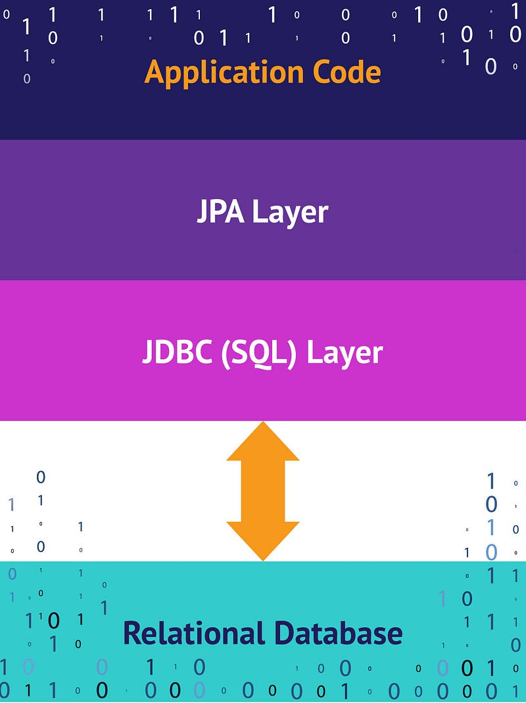
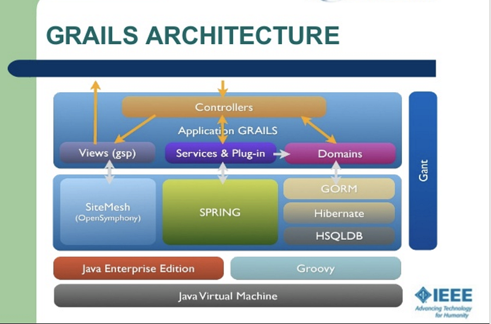
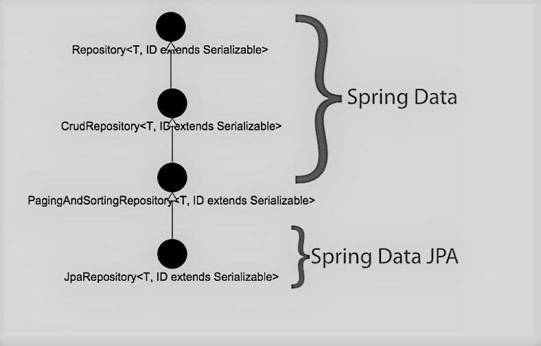
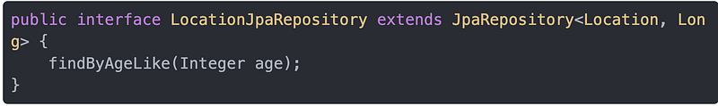

This post will ***Not*** be referring to Onion Architecture but to the fact that building modern backend systems in Java is a process of putting layers on top of layers. Actually not sure software has ever not being about stacking technologies to produce software. I’m going to be talking about two parts of those layers that are fundamental to building enterprise apps with Grails/Spring: Dependency building and data management.

**The ORM Layer**

It’s an adapter layer: it adapts the language of object graphs to the language of SQL and relational tables.

Allows developers to build software that persists data without ever leaving the object-oriented paradigm. It is beautiful, until it gets complicated and you need to unveil the magic behind it to debug problems.

**JDBC The first frontier ~= layer**

Low level, more manual work, less mapping to Object instances.

Example:

String query = “ insert into users (id, name) values (?, ?)”; PreparedStatement ps = conn.prepareStatement(query);

**JPA The interesting layer**

*   The Java ORM standard for storing, accessing, and managing Java objects in a relational database
*   Implementations include Hibernate and EclipseLink
*   JPA is not a great candidate for massive amounts of writes to your data store

  

**GORM Grails data access layer**

Active Record design pattern is employed, consolidating persistence functionality into the domain class itself without requiring up-front development to add these features.

*   Based on Hibernate (now also support NoSQL)
*   Active Record pattern: domain classes do their own operations: campaign.save()
*   Many ways to define queries: where, dynamic finders, criteria, detachedCriteria, executeQuery, executeQuery with native queries

**GORM The good, the bad and the ugly**

***The Good***: 

*   Simplification of queries with dynamic finders and ORM DSL for defining constraints and mappings.

***The Bad***: 

*   Testing can be cumbersome and does not always behave as in real environments.

***The Ugly***:

*   hasMany, belongTo, manyToOne => cascading management

Use Data Services

*   Statically compiled by default
*   Write operations in Data Services are automatically wrapped in a transaction.

**Spring Data**

Dependencies

**spring-boot-starter-data-jpa**

It’s all about Repositories \`Repository\` interface

  

JPA repository adds Query DSL functionality that allows to write queries like findBy, count, countBy, etc

*   Query DSL
*   CRUD operations
*   Paging and sorting
*   Helpers
*   count()
*   exists(Long id)
*   flush()
*   deleteInBatch(Iterable entities)

**Spring Data JPA advantages:**

Easy of integration

Hibernate is default JPA provider in Spring Boot

Having work with Grails you know what this is about

Modeling through annotations on Entity classes

**Recommended practices**

*   Avoid hasMany et all in GORM like the plague
*   Do no let Hibernate generate ddl for your queries
*   Verify that DSL queries are outputting the sql query you expect for complex queries in development.
*   Use Data Services in Grails
*   Use plain Groovy SQL for heavy batch job processing in Grails
*   Use read replica for read-only queries (lists and gets) as much as possible
