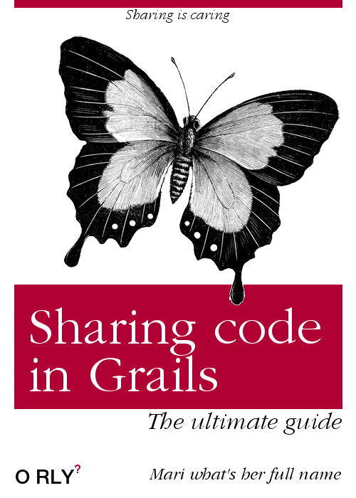

I had a simple small task to perform, make the rendering of errors in a controller I did, work across a couple of controllers. That should be easy enough, I said, but Grails had different plans for me. For this task I only needed *one* function to be shared across a couple of controllers. Turns out that making a class with a static function under `src/groovy` was not enough. In light of full disclosure this function I need to share had a call to render as in `render obj as JSON`, where obj is a map. So that's the relevant part, how to share behavior in controllers when you want to use (controller) functions like render. I found a solution with an important caveat which I discuss at the end, but if it suits your case it is clean and every solution that makes my code cleaner is beautiful.

So here is the thing: Add a trait on a Grails plugin then import the plugin as \`compile\` dependency in the app with your controllers. E.g an exception handler trait:

```groovy
import grails.converters.JSON
import com.mari.ApiError

trait ExceptionHandler {
    def handleControllerError(Exception e) {
        response.status = 400
        render ApiError.unknownError as JSON
    }
}
```

Then in a controller you can implement the trait:

```groovy
class RandomController implements ExceptionHandler {
}
```

You could even extend this and use it for ALL your controllers (That’s on all caps because I’m yelling of excitement), be careful with that tho, maybe later someone else creates a controller and they wonder why it’s doing stuff that they have not told it to do. I personally love this horizontal, ahem aspect oriented way but it makes code flow harder to follow. Now that you have been warned this is how you do it:

```groovy
import grails.artefact.Enhances
import org.grails.core.artefact.ControllerArtefactHandler

@Enhances(ControllerArtefactHandler.TYPE) //you can do the same with ServiceArtefactHandler.TYPE
trait ExceptionHandler {

    def handleControllerError(Exception e) {
        response.status = 400
        render ApiError.unknownError as JSON
    }
}
```

You could even apply`Enhances` annotation to more than one artifact type, say to both controllers and interceptors:

\`@Enhances(\[“Controller”, “Interceptor”\])\`

The reason why for this to work it has to be in a plugin is explained in [this](https://github.com/grails/grails-core/issues/10717) Github issue by one of the Grails creators and main committer:

> … transforms have to be within a JAR for them to work correctly because otherwise they may be compiled at the same time as the target class hence why this only applies to plugins.

Okay back to square one, I don’t want to add this in a plugin (maybe this will be the only thing you’ll be adding to said plugin), what are my options now?

You could apply Groovy AST transformations on your build. *Groovy AST allows you to hook into compilation process and provides ability to modify the existing behavior or add new behavior to classes at compile time.*

Follow [this](http://nimavat.me/blog/apply-groovy-ast-in-same-project-with-custom-gradle-ast-sourceset) link for more info on what to add on your [gradle.build](http://gradle.build) file to make it work. The solution stated there is for Grails applications, as it is already included in plugins by default. Since we already have a Grails plugin for different things it made sense to add it to the plugin.

Did you noticed that all code snippets have imports in them? You’re welcome! Btw the versions used here are Grails Framework 3.3 and Groovy 2.5.

May your behaviors be shareable. Hasta la vista!

---

*Originally published on [Medium](https://medium.com/@mlescaille/sharing-behavior-on-grails-3-controllers-327b7bfb4ad2).*
