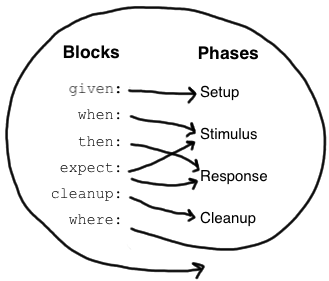

What are we looking for in our tests?

Ken Beck’s article [Test Desiderata](https://medium.com/@kentbeck_7670/test-desiderata-94150638a4b3) provides a good starting point for thinking about what makes a good test. In the article, Ken explores the 10 properties tests should have. I personally think “inspiring” is the most curious one, but it makes sense — passing tests should inspire confidence!

Go and read the article before continuing.

I’ll wait right here.

*\[2 minutes later\]*

Ok, glad you made it back. Here we go.

*Grails is a Groovy-based web application framework for the JVM built on top of Spring Boot. It’s aimed at writing applications quickly and productively*. Survata uses Grails as the backbone of our application API that we use internally and that we expose to partners. While building applications with Grails is relatively easy, scaling and testing them brings its own set of challenges.

In this guide, I’d be focusing on exploring the types of artifacts that make up a Grails web application and recommending how to test each artifact. Buckle up!

### Grails basics

[Grails](https://grails.org/) is a [convention over configuration](https://en.wikipedia.org/wiki/Convention_over_configuration) framework for web development. It has a predefined folder structure that determines how the framework interprets and wires together features. Three fundamental types of artifacts reside in an application: **domains**, which map to DB schema tables; **services**, where business logic should live; and **controllers**, the web layer of your application. Each layer requires its own approach to testing, you should keep in mind what your goals are when you are writing tests for each type of artifact.

### The basics of Grails testing

Grails leverages Spock as a testing framework. Spock is a testing and specification framework for Java and Groovy. It includes unit testing, integration testing, mocking and stubbing.

To run tests grails, navigate to your project in a command line and run grails test-app.

For all the examples below we use Grails version 3.3.9.

### Structure of a Spock Test

Test in Grails resides under src/test and src/integration-test. Because this is a convention, Grails will find and run everything that is a test under those folders when the command grails test-app is run.

### Spock specification and features

Tests are recognized by Spock if a Groovy or Java class extends the abstract class Specification.

What are we looking for in our tests?

Ken Beck’s article [Test Desiderata](https://medium.com/@kentbeck_7670/test-desiderata-94150638a4b3) provides a good starting point for thinking about what makes a good test. In the article, Ken explores the 10 properties tests should have. I personally think “inspiring” is the most curious one, but it makes sense — passing tests should inspire confidence!

Go and read the article before continuing.

I’ll wait right here.

*\[2 minutes later\]*

Ok, glad you made it back. Here we go.

*Grails is a Groovy-based web application framework for the JVM built on top of Spring Boot. It’s aimed at writing applications quickly and productively*. Survata uses Grails as the backbone of our application API that we use internally and that we expose to partners. While building applications with Grails is relatively easy, scaling and testing them brings its own set of challenges.

In this guide, I’d be focusing on exploring the types of artifacts that make up a Grails web application and recommending how to test each artifact. Buckle up!

### Grails basics

[Grails](https://grails.org/) is a [convention over configuration](https://en.wikipedia.org/wiki/Convention_over_configuration) framework for web development. It has a predefined folder structure that determines how the framework interprets and wires together features. Three fundamental types of artifacts reside in an application: **domains**, which map to DB schema tables; **services**, where business logic should live; and **controllers**, the web layer of your application. Each layer requires its own approach to testing, you should keep in mind what your goals are when you are writing tests for each type of artifact.

### The basics of Grails testing

Grails leverages Spock as a testing framework. Spock is a testing and specification framework for Java and Groovy. It includes unit testing, integration testing, mocking and stubbing.

To run tests grails, navigate to your project in a command line and run grails test-app.

For all the examples below we use Grails version 3.3.9.

### Structure of a Spock Test

Test in Grails resides under src/test and src/integration-test. Because this is a convention, Grails will find and run everything that is a test under those folders when the command grails test-app is run.

### Spock specification and features

Tests are recognized by Spock if a Groovy or Java class extends the abstract class Specification.

What are we looking for in our tests?

Ken Beck’s article [Test Desiderata](https://medium.com/@kentbeck_7670/test-desiderata-94150638a4b3) provides a good starting point for thinking about what makes a good test. In the article, Ken explores the 10 properties tests should have. I personally think “inspiring” is the most curious one, but it makes sense — passing tests should inspire confidence!

Go and read the article before continuing.

I’ll wait right here.

*\[2 minutes later\]*

Ok, glad you made it back. Here we go.

*Grails is a Groovy-based web application framework for the JVM built on top of Spring Boot. It’s aimed at writing applications quickly and productively*. Survata uses Grails as the backbone of our application API that we use internally and that we expose to partners. While building applications with Grails is relatively easy, scaling and testing them brings its own set of challenges.

In this guide, I’d be focusing on exploring the types of artifacts that make up a Grails web application and recommending how to test each artifact. Buckle up!

### Grails basics

[Grails](https://grails.org/) is a [convention over configuration](https://en.wikipedia.org/wiki/Convention_over_configuration) framework for web development. It has a predefined folder structure that determines how the framework interprets and wires together features. Three fundamental types of artifacts reside in an application: **domains**, which map to DB schema tables; **services**, where business logic should live; and **controllers**, the web layer of your application. Each layer requires its own approach to testing, you should keep in mind what your goals are when you are writing tests for each type of artifact.

### The basics of Grails testing

Grails leverages Spock as a testing framework. Spock is a testing and specification framework for Java and Groovy. It includes unit testing, integration testing, mocking and stubbing.

To run tests grails, navigate to your project in a command line and run grails test-app.

For all the examples below we use Grails version 3.3.9.

### Structure of a Spock Test

Test in Grails resides under src/test and src/integration-test. Because this is a convention, Grails will find and run everything that is a test under those folders when the command grails test-app is run.

### Spock specification and features

Tests are recognized by Spock if a Groovy or Java class extends the abstract class Specification.

```groovy
class CampaignServiceSpec extends Specification {
  // fields
  // fixture methods
  // feature methods
  // helper methods
}
```

Specification contains a number of useful methods for writing specifications. Furthermore, it instructs JUnit to run your specification with Sputnik, Spock’s JUnit runner. Thanks to Sputnik, Spock specifications can be run by most modern Java IDEs and build tools.

> *Spock lets you write specifications that describe expected features (properties, aspects) exhibited by a system of interest. The system of interest could be anything between a single class and a whole application, and is also called the “system under specification” or SUS.*

**Fields**

Instance fields are a good place to store objects belonging to a specification’s *fixture*. It is good practice to initialize these fields right at the point of declaration. (Semantically, this is equivalent to initializing them at the very beginning of the setup() method). Objects stored into instance fields are not shared between feature methods. Instead, every feature method gets its own object. This helps to isolate feature methods from each other, which is often a desirable goal.

Sometimes you need to share an object between feature methods. For example, the object might be very expensive to create, or you might want your feature methods to interact with each other. To achieve this, declare a @Shared field.

```groovy
@Shared res = new VeryExpensiveResource()
@Shared survey = surveyDataService.get(1) // shared resource by several feature methods
```

**Fixture methods**

Fixture methods are responsible for setting up and cleaning up the environment in which feature methods are run. All fixture methods are optional.

```groovy
def setupSpec // runs once -  before the first feature method
def setup // runs before every feature method
def cleanup // runs after every feature method
def cleanupSpec // runs once -  after the last feature method
```

**Feature methods**

Feature methods are the heart of a specification and are Spock’s way of calling a test method. By convention, feature methods are named with String literals. These are the names that we see when the test suite is running so it’s important to use meaningful names that convey the purpose of the test.

A feature method is structured into so-called *blocks.* Blocks start with a label and extend to the beginning of the next block or the end of the method. There are six kinds of blocks: given, when, then, expect, cleanup, and where blocks.



Image source: [Spock reference documentation](http://spockframework.org/spock/docs/1.3/all_in_one.html)

But talk is cheap…


Alright, alright, I have been talking a lot without showing you how it is done. Allow me.

Let’s say we have an application that manages campaigns for its customers and we have a Campaign domain object and a CampaignService class to manage the logic of creating, updating, listing and deleting campaign objects. While we build the operations of CampaignService we also update our tests.

**Testing domain classes**

Let’s look at a unit test for the Campaign domain class.

```groovy
package com.testguide

import grails.testing.gorm.DomainUnitTest
import org.springframework.validation.FieldError
import spock.lang.Specification

import static com.testguide.StringUtil.newUuid
import static com.testguide.test.UnitTestDomainFactory.createDomain

class CampaignSpec extends Specification implements DomainUnitTest<Campaign> {
    void "invalid creation of a campaign"() {
        given: "a user"
            def user = createDomain(User)
        and: "a survey"
            def survey = createDomain(Survey, [user: user])
        when: "the domain has lacks the required properties"
            domain.survey = survey
            domain.uuid = newUuid()
        then: "the campaign is invalid"
            !domain.validate()
        and:
            domain.errors.fieldErrors.size() > 0

    }

    void "valid creation of a campaign"() {
        given: "a user"
            def user = createDomain(User)
        and: "a survey"
            def survey = createDomain(Survey, [user: user])
        when: "the domain has the required properties"
            domain.user = user 
            domain.survey = survey
            domain.uuid = newUuid()
        then: "the campaign is valid"
            domain.validate()
    }
}
```

This is a good example of using the traits that Grails provide for testing, but be mindful to avoid testing every feature of the framework. Test your assumptions of the behavior and dependencies your domain classes should have.

Each block in the feature method is providing information to the following block and the order of execution is as shown. This test is checking a basic campaign creation flow.

```groovy
import grails.testing.gorm.DomainUnitTest
import spock.lang.Specification

class CampaignSpec extends Specification implements DomainUnitTest<Campaign> {
}
```

Grails provides on top of Spock a few utility classes and interfaces to test the different artifacts it provides.DomainUnitTest, ServiceUnitTest, and ControllerUnitTest are Groovy traits provided by Grails for unit testing domains, services, and controllers respectively. You can use them or not, the traits provide the convenience of having a keyword domain, service and controller respectively to refer to an instance of the class under test and provide a mock registering in the application context (Autowired for you). Each of the traits provides specific utilities e.g ControllerUnitTest provides access to variables view, request, response and model in addition to wiring controller to the given controller being parametrized. I recommend since you are already riding this horse that you take advantage of it and use it for your unit tests. We use it extensively for controllers and domain class tests.

**Testing Services**

You can unit test services in a similar way you test domain classes by extending ServiceUnitTest. For most of the operations we do at Survata, we instead prefer to integrate test our services (since our services handle pretty much all our web application logic.)

Here is an integration test for our CampaignService class (as denoted by the annotations at the beginning of the class).

```groovy
package com.testguide

import com.testguide.CampaignService
import com.testguide.User
import com.testguide.dataservice.UserDataService
import grails.testing.mixin.integration.Integration
import grails.web.servlet.mvc.GrailsParameterMap
import org.springframework.mock.web.MockHttpServletRequest
import org.springframework.test.annotation.Rollback
import org.springframework.transaction.annotation.Transactional
import spock.lang.Specification

/**
 * Test class for {@link CampaignService}
 */
@Integration
@Transactional
@Rollback
class CampaignServiceSpec extends Specification {
    UserDataService userDataService

    //class under test
    CampaignService campaignService

    def setup() {//for this spec the setup does not have to do anything
    }

    void "list all campaigns"() {
        given: "a user"
            User user = userDataService.findById(1)
        and: "an instance of GrailsParameterMap"
            def requestParams = [startDate: '2019-03-06', endDate: '2019-03-08']
            MockHttpServletRequest mockHttpServletRequest = new MockHttpServletRequest()
            mockHttpServletRequest.parameters = requestParams
            mockHttpServletRequest.getParameterMap()
            def params = new GrailsParameterMap(mockHttpServletRequest)
        when: "a call to list campaigns is made"
            Tuple2 result = campaignService.list(user, params)
        then: "result"
            result
        and: "it contains the campaign list"
            result.first.campaignList
        and: "the campaign list is 3"
            result.first.campaignList.size() == 3
    }
}
```

**Testing controllers**

At the beginning (We are getting rid of this pattern) our controllers looked like:

```groovy
def controllerFunction() {
	def user = User.get(params.userId)
	if (!userPermissionService.hasPermissionToDoThis(user) {
		response.status = 403
		render "User unauthorized"
		return 
	}
	def comments = commentsService.getByUser(user) 
	...
	
	render finalObject as JSON		
 }
```

Now we are moving to a more all logic in services pattern and our controllers look more like:

```groovy
def controllerFunction() {
	def (successObj, errorObj) = service.func(params)
	if (errorObj) {
       response.status = errorObj.status : 404
       render errorObj.message as JSON ?: WebserviceError.resourceNotFound as JSON
       return
    }

  render(view: "list", model: [campaignList: successObj])
		
 }
```

More beautiful huh? And easier to test as well. Also, note we moved to use JSON views instead of rendering as JSON.

Now to test this controller function we can mock the service and get a result and test the true work of the controller, the model, and the view:

```groovy
void "func successfully" () {
		given: "a campaign object"
			def campaign = createDomain(campaign)
        when:
            request.method = 'GET'
            request.contentType = 'application/json'

            params.uuid = beaconDefinition.uuid
            params.startDate = new Date().format("yyyy-MM-dd")
            params.endDate = new Date().plus(1).format("yyyy-MM-dd")

            controller.campaignService = Stub(CampaignService) {
                func(_ as GrailsParameterMap) >> {
                    def errorObj = [:]
                    def successObj = [campaign: campaign]
                    return new Tuple2(successObj, errorObj)
                }
            }
            controller.session.userId = currentUser.id
            controller.controllerFunction()

        then: "response"
            response
		and: "status is 200"
            response.status == 200
		and: "campaign list view was invoked"
			response.view == 'list'
		and: "model has the campaign object"
			model.campaign == campaign
    }
```

Simplifying our controllers also simplifies our tests and how we approach them.

What about integration tests for controllers? This is an approach:

Note: you’ll need to include this library for using RestBuilder

Gradle config: testCompile “org.grails:grails-datastore-rest-client”

```groovy
package com.testguide

import com.testguide.CampaignController
import grails.core.GrailsApplication
import grails.gorm.transactions.Transactional
import grails.plugins.rest.client.RestBuilder
import grails.plugins.rest.client.RestResponse
import org.springframework.web.util.UriComponentsBuilder
import spock.lang.Specification
import spock.lang.Shared

import grails.testing.mixin.integration.Integration
import org.springframework.test.annotation.Rollback

/**
 * Integration test for {@link CampaignController}.
 */
@Integration
@Rollback
@Transactional
class CampaignControllerIntegrationSpec extends Specification {
    @Shared RestBuilder rest = new RestBuilder()
    GrailsApplication grailsApplication

    def 'campaign controller func'() {
        given:
            String baseUrl = getLocalUri() //however you build your urls
            String finalEndpoint = buildEndpoint(baseUrl)
        when:
            RestResponse resp = rest.post(finalEndpoint) {
                auth "<auth_details>", "more_auth_details"
                contentType "application/json"
                json getResourceText("campaign_request.json")
            }

        then:
            resp.status == 200
            resp.json.size() == 2
            resp.json.find { it.name == 'campaign-name-zxsde' }
            resp.json.findAll { it.user.username == 'mari' }.size() == 1
    }
}
```

There are so many more options in terms of testing your controllers’ results, but that is subject for another guide (about contract testing APIs).

**Testing exception conditions**

All of the code examples so far are simple and happy, nothing bad happens in them. But that’s usually not the case in our test so let’s look at an example on how to test when Exceptional cases occur.

```groovy
when:
	stack.pop()
then:
	thrown(EmptyStackException)
	stack.empty
```

[Spock](http://spockframework.org/spock/docs/1.3/all_in_one.html) is very powerful and there are many more features worth examining that we use like [data-driven testing](http://spockframework.org/spock/docs/1.3/all_in_one.html#_data_driven_testing) with data tables and [Interactions](http://spockframework.org/spock/docs/1.3/all_in_one.html#_interaction_based_testing).

### Extra tips

**Groovy metaclass**

You can take advantage of the Groovy metaclass system to mock results. For example:

```groovy
void testSearch() {
        registerMetaClass User
        User.metaClass.static.search = { searchText ->
            [results: [new User(username:'mari')],
             total: 1, offset: 0, scores: [1]]
        }
        assertEquals 'mari', User.search('mari').results[0].username
 }
```

When the searchText function is called for a user object in your test, then a user with username Mari will be returned.

**IDE support**

You can run tests on the command line using Grails-provided commands or use your IDE support for Grails to run them. There is [a guide](https://www.jetbrains.com/help/idea/testing-grails-applications.html) on how to run tests for IntelliJ that’s useful if you use IntelliJ. TL;DR: Remember to run the test as a Grails test as opposed to JUnit tests if you are using Grails specific features, which is our case most of the time. This is a free tip brought to you by the pain of seeing my tests fail in IntelliJ when running as JUnit tests. (You’re welcome!)

### Wrapping up

This was supposed to be a haiku and ended up being an essay. That’s because there’s a lot of ground to cover, but fear not, once you understand the basics and get some examples, it all becomes clearer.

May your tests always inspire (confidence).

You want to know more you say? I hear you, here is another useful link:

[Grails latest testing guide](https://testing.grails.org/latest/guide/index.html)

---

*Originally published on [Medium](https://medium.com/@mlescaille/testing-with-grails-5876efd0586c).*
