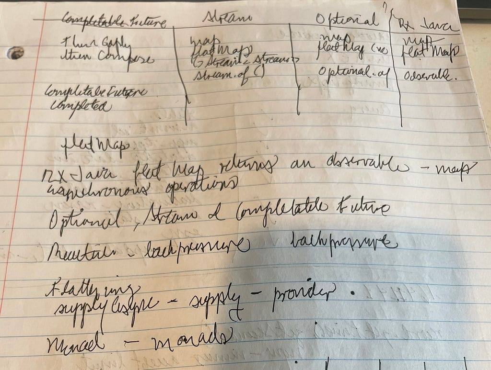
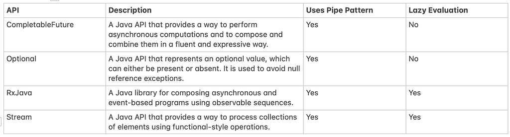
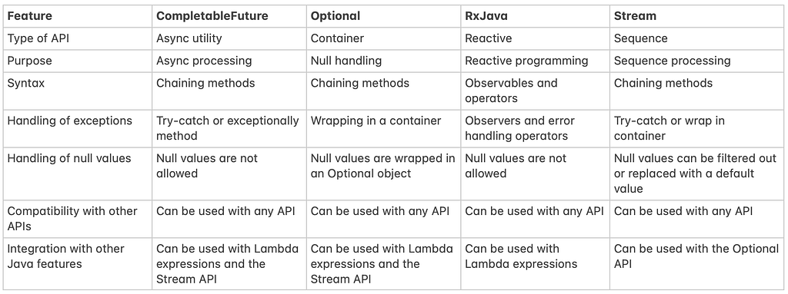

> “Well, the first rule is that you can’t really know anything if you just remember isolated facts and try and bang ’em back. If the facts don’t hang together on a latticework of theory, you don’t have them in a usable form.” — Charlie Munger

What has become evident for me over time with programming, designing systems and working with Java is that many patterns overlap features across nomenclatures, languages and purposes. As John Muir said:

> “When we try to pick out anything by itself, we find it hitched to everything else in the Universe.”

Java is not an exception, as well as many programming techniques and patterns in software, there are commonalities you can find that will help you *hang the facts together in a latticework of theory.*



I have worked with all of these independently (Streams, Optional, RxJava, and CompletableFuture), and yet connecting them in a meaningful way makes me remember and understand the operations even better, not in a simplistic or mechanic way. The type of understanding that comes like a gift.

Okay time to pull some weight in these words. First depending on where you are in your journey, you might or might not know what the pipe (a.k.a pipelines) pattern is, but even if you haven’t heard about it, you’ll likely have use it if you work with modern OO languages or use a Mac or Unix terminal.

According to [Wikipedia](https://en.wikipedia.org/wiki/Pipeline_\(software\)) in the context of software a pipeline:

> consists of a chain of processing elements ([processes](https://en.wikipedia.org/wiki/Process_\(computing\)), [threads](https://en.wikipedia.org/wiki/Thread_\(computer_science\)), [coroutines](https://en.wikipedia.org/wiki/Coroutine), [functions](https://en.wikipedia.org/wiki/Subroutine), *etc.*), arranged so that the output of each element is the input of the next; the name is by analogy to a physical [pipeline](https://en.wikipedia.org/wiki/Pipeline_transport).

Hold to that thought because the generalization of processing elements is important. But this is a rather abstract definition. A more simpler one is *The pipeline pattern is a software design pattern that provides the ability to* ***build*** *and execute a* ***sequence*** *of operations.*

How is that related to Java, you might ask, since I started with that *hitched to everything else* quote. Let’s first start introducing the features that provide chaining of processing elements.



We can see how every one of these languages API or libraries are used for very different purposes: asynchronous processing, null handling, collections processing and reactive programming.



The main distinction in these is that the higher the level of expression the API provides, the higher the complexity of getting it right. (Plus harder code to read, debug, and reason about: looking at you CompletableFuture).

#### Show me the code

You’ll likely know how some *Optional* code looks, like, for example, our very useful code gist here, likely very wrong for many use cases in different languages, but let’s use it to illustrate the pipe nature of

Optional:

```java
public void cleanName(String firstName, Optional<String> middleName, String lastName) {
        middleName
                .filter(value -> value != null && value.length() >= 1)
                .map(value -> firstName + " " + value + lastName)
                .ifPresent(System.out::println);
}
```

Stream:

```java
public static void pipeStreams() {
        ArrayList<String> listOne = new ArrayList<>(Arrays.asList("a", "b", "c", "d", "e"));

        ArrayList<String> listTwo = new ArrayList<>(Arrays.asList("a", "b", "c", "f", "g"));

        //some pipe-d dreams
        List<String> combinedList = Stream.of(listOne, listTwo)
                .flatMap(Collection::stream)
                .filter(element -> !Objects.equals(element, ""))
                .map(element -> element + " " + element)
                .peek(System.out::println)
                .collect(Collectors.toList());
}
```

RxJava: (Observable)

*   Rx is not part of the JVM library and needs a dependency to the rx library: compile 'io.reactivex.rxjava:rxjava:2.2.2'

```java
Observable<T> processSomeMessage(String message) {
        return Observable.just(message)
                .subscribeOn(Schedulers.from(executor))
                .doOnNext(messageReceived -> System.out.println("Received a message", messageReceived))
                .doOnError(exception -> {
                    System.out.println("Oops better log this somewhere where it can be actioned on " + message + " " + exception);
                })
                .map(messageParser::parse)
                .filter(Optional::isPresent)
                .map(Optional::get)
                .doOnNext(event -> System.out.println("Event " + event))
                .flatMap(AClassThatHasThisMethod::processMessage);
}
```

CompletableFuture:

```java
void putObjectAsync(String bucketName, String objectKey, String objectPath) {
        S3AsyncClient s3AsyncClient = S3AsyncClient.create();
        PutObjectRequest putObjectRequest = PutObjectRequest.builder()
                .bucket(bucketName)
                .key(objectKey)
                .build();
        CompletableFuture<PutObjectResponse> future = s3AsyncClient.putObject(putObjectRequest,
                AsyncRequestBody.fromFile(Paths.get(objectPath)));

        future
                .whenComplete((resp, err) -> {
                    try {
                        if (resp != null) {
                            System.out.println("Yay, a response " + resp);
                        } else {
                            // Handle error
                            System.out.println("Welp, this is indeed not right around " + objectPath + " in S3 " + err.getMessage());
                        }
                    }
                  finally {
                        //closing resources is usually wise, at what point is the real question, but this is a gist :)
                        s3AsyncClient.close();
                    }
                    ;

                    future.join();
                })
                .thenAccept(System.out::println);

}
```

CF is the beast of the pipe-d APIs discussed here. With **about 50 different methods for composing, combining, and executing asynchronous computation steps and handling errors**. (src: [Guide to CompletableFuture](https://www.baeldung.com/java-completablefuture)). CF is one of the most expressive of the APIs mentioned before, which makes it one of the more complex, and thus where the chaining aspect of the pipeline pattern really shines.

Each of these APIs processes different elements and is built for different purposes in the Java ecosystem. Yet, the visual structure of the code really makes the commonalities stand out: chaining, operations names, processing elements and stages.

At this point, is more likely to have our facts in a more usable form, one that is sticky in the face of similar problems and or APIs. And that’s not a pipe dream.

Ps: These APIs can be found in other contexts with different names: flow APIs, and reactive programming in the case of RxJava, which should not change the central theme of the post too much. If anything adds beauty to the many ways simple syntax can express many concepts.

Ps2: ChatGPT did the comparison tables in this post with my prompting, it is very good at presenting information in tabular relatively quickly.

Ps3: There is a bug in one of these code gists, nothing will be awarded to those who find it more than this acknowledgement. Stay finding those 🐛.

---

*Originally published on [Medium](https://mlescaille.medium.com/if-they-dont-hang-together-you-don-t-have-them-or-the-pipe-pattern-to-the-rescue-f5e4aec441c5).*
