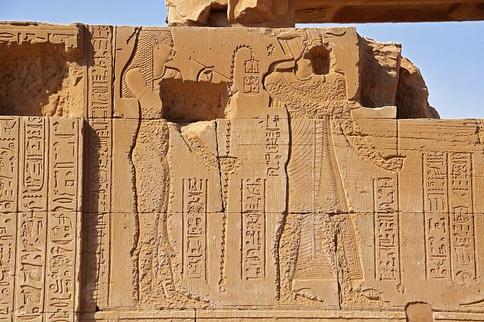

Archeology is the study of human history and prehistory through the excavation of sites and the analysis of artifacts and other physical remains. Code archeology it is the practical understanding of code, its context and evolution.

> *“We’re programmers. Programmers are, in their hearts, architects, and the first thing they want to do when they get to a site is to bulldoze the place flat and build something grand. We’re not excited by incremental renovation: tinkering, improving, planting flower beds”. — Joel Spolsky*

Code archeology is the interest and focus in **incremental renovation**. We define code archeology as an exercise to dig into a codebase and gather context of how the code came to be by tracing back the changes, understanding the overall architecture and component design in line with the business the code operates on. As the business evolved, you can trace changes in the code as well. And conversely, by seeing the changes in the code you can see how the business decisions were changing.

Code archeology is not only reading code, debugging or refactoring. It’s the overall process of comprehension and analysis of evolution of a system or a piece of software. This process can then lead to debug and/or refactoring or migration of the systems.

### Why we should be interested in code archeology?

*Developers spend ∼58% of their time on program comprehension activities.* Increasingly our job as software engineers is not only to write code, but to maintain existing systems, migrate old systems to new technologies and modify existing software. It is a fundamental ability to be able not only to read the code syntax but to understand the context it lives on.

### How do you measure someones knowledge of code archeology

It is hard to measure in interviews. It is probably harder to measure in day to day in companies. Here are some ways you can assess code archeology ability:

*   Do pair programming sessions on an existing code base.
*   Design an interview problem that have already pieces of code for extension or bug correction.
*   Design a take home exercise that already has code in it to fill in.

### What is the main challenge with code archeology?

*   It is hard to teach: as Djisktra said:

> *widespread underestimation of the specific difficulties of size seems one of the major underlying causes of the current software failure.*

---

*Originally published on [Medium](https://medium.com/@mlescaille/what-is-code-archeology-31476eb50457).*
